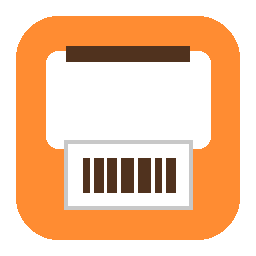

<p align="center">
  
</p>

<h1 align="center">PrintPal</h1>

<p align="center">
  One-click shipping label cropper and printer for Windows.
</p>

<p align="center">
  <a href="https://github.com/parsaj-dev/PrintPal/releases/latest"></a>
  
  
  <a href="https://github.com/parsaj-dev/PrintPal/blob/main/LICENSE"></a>
</p>

---

## Table of Contents

- [What it does](#what-it-does)
- [Download](#download)
- [How the detection works](#how-the-detection-works)
- [Input handling](#input-handling)
- [Configuration](#configuration)
- [Building from source](#building-from-source)
- [Running tests](#running-tests)
- [Project structure](#project-structure)

## What it does

1. Download a return label PDF and copy the file (or its path) to the clipboard.
2. Click the PrintPal icon in the taskbar.
3. It reads the file, finds the shipping label, crops out the legal text and instructions, rotates it upright, and sends it to your label printer.

If the crop looks good (high confidence), it prints immediately with a quick notification. If it's not sure, it shows a preview window so you can check before printing.

Designed for thermal label printers like the DYMO LabelWriter 450 and similar. Works with FedEx, UPS, Amazon, and any return label PDF that has barcodes.

## Download

Grab the latest `PrintPal.exe` from the [Releases page](https://github.com/parsaj-dev/PrintPal/releases/latest). No installation needed, just run it. Pin it to your taskbar for one-click access.

## How the detection works

No cloud services, no AI, no network access. Everything runs locally.

- Rasterizes the PDF page at 200 DPI.
- Finds barcodes with [pyzbar](https://github.com/NaturalHistoryMuseum/pyzbar). Their position and orientation anchor the crop.
- Grows from the barcode region to the full label using a two-pass gap merge (vertical, then horizontal). The gap thresholds adapt to the whitespace distribution on each page instead of using hardcoded values.
- Adds a quiet-zone margin so barcodes are not clipped.
- Rotates upright based on barcode orientation.
- Rechecks that barcodes still scan in the cropped output. If they don't, confidence drops and it shows a preview instead of auto-printing.

Falls back to the largest content block on the page if no barcodes are found, but flags this as low confidence and always shows the preview.

## Input handling

PrintPal looks for a label file in this order:

1. **Command line argument** -- pass a file path directly (`PrintPal.exe "C:\Downloads\label.pdf"`).
2. **Clipboard file** -- right-click a file in Explorer and Copy, then click PrintPal.
3. **Clipboard text path** -- use Windows "Copy as path" (Ctrl+Shift+C), then click PrintPal.

Supports PDF, PNG, and JPEG. The source file is never modified, moved, or deleted.

## Configuration

Settings live in `%APPDATA%\PrintPal\config.toml`, created with defaults on first run:

| Setting | Default | What it does |
|---|---|---|
| `printer` | `DYMO LabelWriter 450` | Name of the target printer |
| `media_size` | `4x6` | Label media size |
| `dpi` | `200` | Rasterization DPI (lower = faster on slow machines) |
| `crop_margin_inches` | `0.06` | Extra margin around the detected label |

You can also change settings from the Settings button in the preview window.

## Building from source

Requires Python 3.10+ on Windows. On Windows, pyzbar needs the zbar DLL -- the PyInstaller build bundles it automatically.

```bash
pip install -e ".[dev]"
pyinstaller printpal.spec
```

The output is `dist/PrintPal.exe`.

Releases are built automatically by GitHub Actions on a Windows runner when a version tag is pushed.

## Running tests

```bash
pip install -e ".[dev]"
pytest tests/ -v
```

Unit tests (gap merging, adaptive thresholds, blank page handling) run without any fixtures. To run integration tests, drop a shipping label PDF at `tests/fixtures/sample_label.pdf` and they'll verify the full detection pipeline.

## Project structure

```
src/printpal/
    main.py          entry point, input resolution, single-instance guard
    detect.py        barcode detection, gap-merge cropping, rotation, recheck
    rasterize.py     PDF/image to PIL Image via PyMuPDF
    clipboard.py     Windows clipboard (CF_HDROP and text path)
    printing.py      Windows GDI print spooler
    config.py        TOML config in AppData
    log.py           rotating file logger
    ui.py            tkinter preview window and settings dialog
tests/
    test_detect.py   detection unit and integration tests
    test_config.py   config round-trip tests
```
